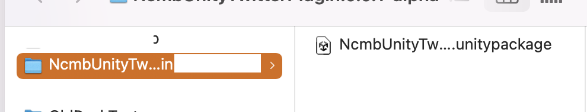
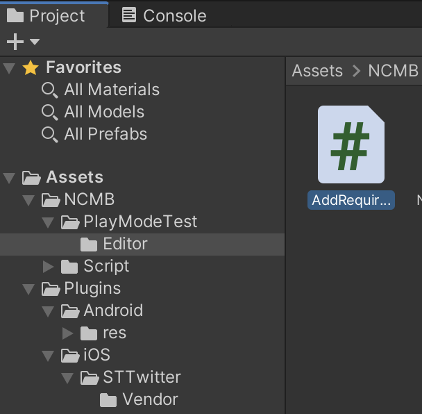

# NcmbUnityTwitterPlugin

## Overview
NcmbUnityTwitterPlugin is a plugin which support NcmbUnity's signin with Twitter on Android and iOS.
This plugin using assets from [NcmbUnityAndroidTwitterPlugin](https://github.com/vfa-tamhh/NcmbUnityAndroidTwitterPlugin) for Android and  [STTwitter](https://github.com/vfa-tamhh/STTwitter) for iOS.

* Note: This plugin is create base on NCMB Unity version 4.4.1

## Plugin installation

1. Create new project by Unity.
2. Import NCMB libs. See the [NCMB Unity Quick Start](https://mbaas.nifcloud.com/doc/current/introduction/quickstart_unity.html) for more details.
3. Please open the release page of Github from the link below and download NcmbUnityTwitterPlugin.x.x.x.zip (x is the version number) [Github release page](https://github.com/vfa-tamhh/NcmbUnityTwitterPlugin/releases)


4. Unzip the zip file and Double-click "NcmbUnityTwitterPlugin.unitypackage" in the folder to import.




## Usage

```C#
void Start()
{
    // sample SCHEME = myapp://
    NCMBOAuthTwitter.Init("TWITTER_KEY", "TWITTER_SECRET_KEY", "SCHEME");
}

// Update is called once per frame
void Update()
{

}
public void pressMe()
{
    INCMBTwitterCallback callback = new CallbackTwitter();
    NCMBOAuthTwitter.LogIn(callback);
    Debug.Log("Call login here....");
}

private class CallbackTwitter : INCMBTwitterCallback
{
    public void OnFailure(string errorMessage)
    {
        Debug.Log("errorMessage: " + errorMessage);
    }

    public void OnSuccess(string id, string userName, string token, string tokenSecret)
    {
        NCMBTwitterParameters parameters = new NCMBTwitterParameters(
            id.ToString(),
            userName,
            "TWITTER_KEY",
            "TWITTER_SECRET_KEY",
            token,
            tokenSecret
        );
        NCMBUser user = new NCMBUser();
        user.AuthData = parameters.param;
        //ニフクラ mobile backendにログイン
        user.LogInWithAuthDataAsync((NCMBException e) =>
        {
            Debug.Log("Login successfully!");
        });
        
    }
}

```

## License

The NcmbUnityTwitterPlugin is licensed under the Apache License 2.0. See the [LICENSE](LICENSE) file for more details.